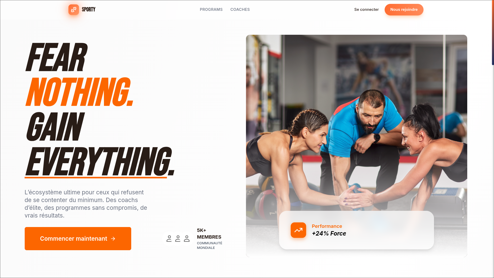
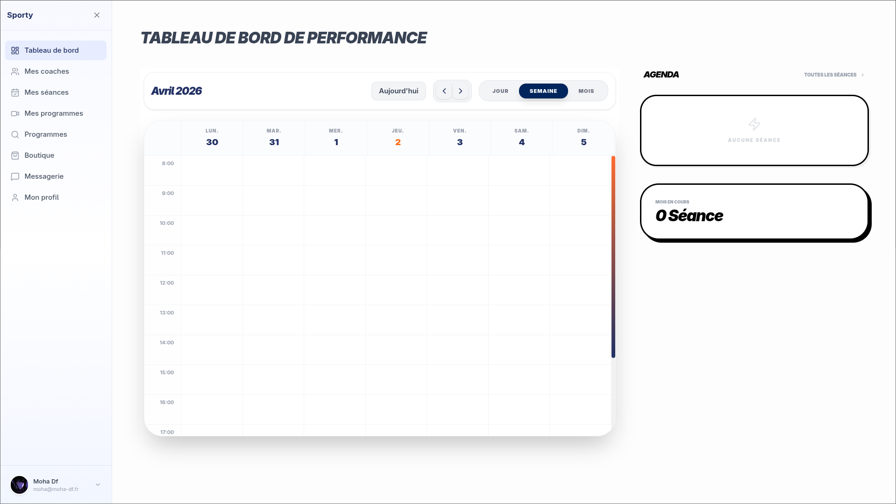
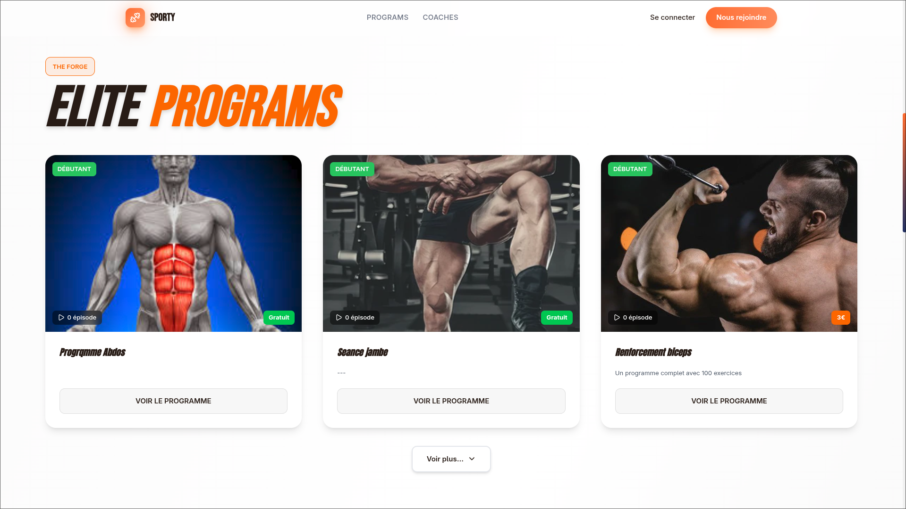
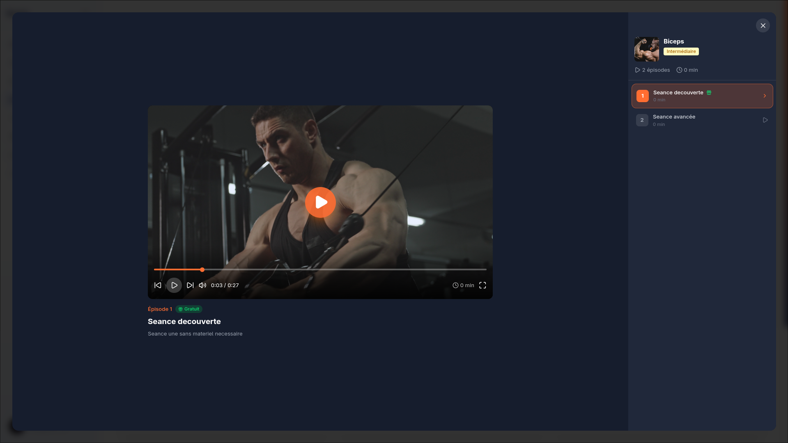

# Sporty - Plateforme web de coaching

Projet **Sporty** (Master Informatique - UHA), une plateforme de coaching sportif qui connecte:
- des clients,
- des coachs,
- des responsables d'etablissement,
- des administrateurs.

Le projet est maintenant structure en **monorepo** avec 3 dossiers principaux.

## Structure du projet

- `front/` : application frontend (React, TypeScript, Vite)
- `back/` : API backend (Node.js, Express, Supabase, Socket.io, Stripe)
- `doc/` : documentation technique (architecture, BDD, Storybook, Swagger)

## Demarrage rapide (local)

### 1. Installer les dependances

```bash
cd front && npm install
cd ../back && npm install
```

### 2. Configurer les variables d'environnement

```bash
cp back/.env.example back/.env
cp front/.env.example front/.env
```

Renseignez vos cles (Supabase, Stripe, Cloudinary, Google OAuth, etc.).

### 3. Lancer le backend

```bash
cd back
npm run dev
```

Backend disponible sur `http://localhost:5000`.

### 4. Lancer le frontend

Dans un autre terminal:

```bash
cd front
npm run dev
```

Frontend disponible sur `http://localhost:5173`.

## Deploiement de demo

Application en ligne: **https://sporty-blue.vercel.app/**

Note: le backend peut mettre quelques secondes a se reveiller (hebergement gratuit).

## Comptes de test

| Role | Email | Mot de passe |
| :--- | :--- | :--- |
| Coach | `coach01@example.com` | `Test.123` |
| Client | `client01@example.com` | `Test.123` |
| Responsable | `resp01@example.com` | `Test.123` |
| Admin | `admin@sporty.com` | `AdminCoaching0` |

## Captures d'ecran

### IHM du projet

#### Page d'acceuil


#### Authentification


#### Calendrier de tableau de bord


#### Programme




Les captures d'ecran des page du projet sont disponibles sur votre page Imgur également.

- Album Imgur: **[IHM](https://imgur.com/a/sporty-website-image-IYUDmvy)**

Des que vous me donnez le lien Imgur, je peux integrer directement les images dans ce README avec affichage inline.

## Documentation

- Documentation technique generale: [doc/README.md](./doc/README.md)
- Architecture: [doc/ARCHITECTURE.md](./doc/ARCHITECTURE.md)
- Frontend: [front/README.md](./front/README.md)
- Backend: [back/README.md](./back/README.md)
